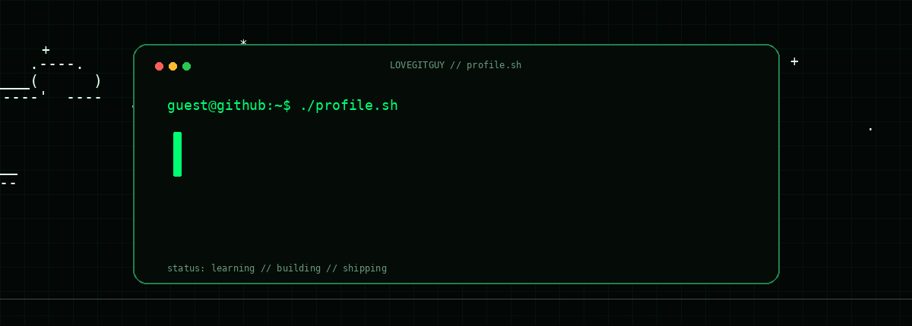

<div align="center">

<picture>
  <source media="(prefers-color-scheme: dark)" srcset="assets/ascii-terminal-dark.gif">
  <source media="(prefers-color-scheme: light)" srcset="assets/ascii-terminal-light.gif">
  
</picture>

<br/>

<a href="https://github.com/lovegitguy">
  
</a>


<br/><br/>


</div>

---

## `01 // whoami`

```text
┌─────────────────────────────────────────────────────────────┐
│                                                             │
│  NAME        → lovegitguy                                   │
│  ROLE        → Developer                                    │
│  CURRENTLY   → Backend Development                          │
│  LEARNING    → DSA + Algorithms                             │
│  MINDSET     → Build → Break → Debug → Learn                │
│                                                             │
└─────────────────────────────────────────────────────────────┘
```

I like understanding **what happens underneath the interface** — from designing interfaces
to writing backend systems and figuring out why a piece of code refuses to work at 2 AM.

Right now, most of my time goes into **backend development, DSA, Linux, and problem solving.**

---

## `02 // stack`

<div align="center">

**LANGUAGES**


**BACKEND / DATABASES**


**FRONTEND / DESIGN**


**TOOLS / ENVIRONMENT**


</div>

---

## `03 // github_stats`

<div align="center">

<picture>
  <source media="(prefers-color-scheme: dark)" srcset="https://github-readme-stats.vercel.app/api?username=lovegitguy&show_icons=true&hide_border=true&bg_color=0d1117&title_color=39ff9a&icon_color=39ff9a&text_color=c9d1d9">
  <source media="(prefers-color-scheme: light)" srcset="https://github-readme-stats.vercel.app/api?username=lovegitguy&show_icons=true&hide_border=true&bg_color=ffffff&title_color=087f45&icon_color=087f45&text_color=334155">
  
</picture>

<picture>
  <source media="(prefers-color-scheme: dark)" srcset="https://github-readme-stats.vercel.app/api/top-langs/?username=lovegitguy&layout=compact&hide_border=true&bg_color=0d1117&title_color=39ff9a&text_color=c9d1d9">
  <source media="(prefers-color-scheme: light)" srcset="https://github-readme-stats.vercel.app/api/top-langs/?username=lovegitguy&layout=compact&hide_border=true&bg_color=ffffff&title_color=087f45&text_color=334155">
  
</picture>

<br/>

<picture>
  <source media="(prefers-color-scheme: dark)" srcset="https://github-readme-streak-stats.herokuapp.com/?user=lovegitguy&hide_border=true&background=0d1117&stroke=39ff9a&ring=39ff9a&fire=39ff9a&currStreakLabel=39ff9a&sideLabels=c9d1d9&dates=8b949e">
  <source media="(prefers-color-scheme: light)" srcset="https://github-readme-streak-stats.herokuapp.com/?user=lovegitguy&hide_border=true&background=ffffff&stroke=087f45&ring=087f45&fire=087f45&currStreakLabel=087f45&sideLabels=334155&dates=64748b">
  
</picture>

</div>

---

## `04 // contribution_snake`

<div align="center">

<picture>
  <source media="(prefers-color-scheme: dark)" srcset="https://raw.githubusercontent.com/lovegitguy/lovegitguy/output/github-contribution-grid-snake-dark.svg">
  <source media="(prefers-color-scheme: light)" srcset="https://raw.githubusercontent.com/lovegitguy/lovegitguy/output/github-contribution-grid-snake.svg">
  
</picture>

</div>

The workflow generates separate light and dark snake SVGs automatically.

---

## `05 // activity`

<div align="center">

<picture>
  <source media="(prefers-color-scheme: dark)" srcset="https://github-readme-activity-graph.vercel.app/graph?username=lovegitguy&theme=github-compact&hide_border=true&bg_color=0d1117&color=39ff9a&line=39ff9a&point=c9d1d9">
  <source media="(prefers-color-scheme: light)" srcset="https://github-readme-activity-graph.vercel.app/graph?username=lovegitguy&theme=github-compact&hide_border=true&bg_color=ffffff&color=087f45&line=087f45&point=334155">
  
</picture>

</div>

---

## `06 // currently_learning`

```text
[████████████████░░░░]  Backend Development
[███████████░░░░░░░░░]  Data Structures & Algorithms
[█████████░░░░░░░░░░░]  Problem Solving
[███████░░░░░░░░░░░░░]  System Design
```

> The bars aren't percentages.  
> There is always another layer underneath.

---

## `07 // featured_projects`

<div align="center">

<a href="https://github.com/lovegitguy/dsa-solutions">
  
</a>

<!-- Replace this with your second real repository -->
<a href="https://github.com/lovegitguy/project-two">
  
</a>

</div>

---

## `08 // connect`

<div align="center">

<a href="https://github.com/lovegitguy">
  
</a>

<a href="https://linkedin.com/in/lovegitguy">
  
</a>

<a href="https://twitter.com/lovegitguy">
  
</a>

</div>

<br/>

<div align="center">

```text
┌────────────────────────────────────────────┐
│                                            │
│       BUILD SOMETHING.                    │
│       SOLVE SOMETHING.                    │
│       LEARN SOMETHING.                    │
│                                            │
└────────────────────────────────────────────┘
```

`while(alive) { learn(); build(); repeat(); }`

**Thanks for stopping by. 👋**

</div>
